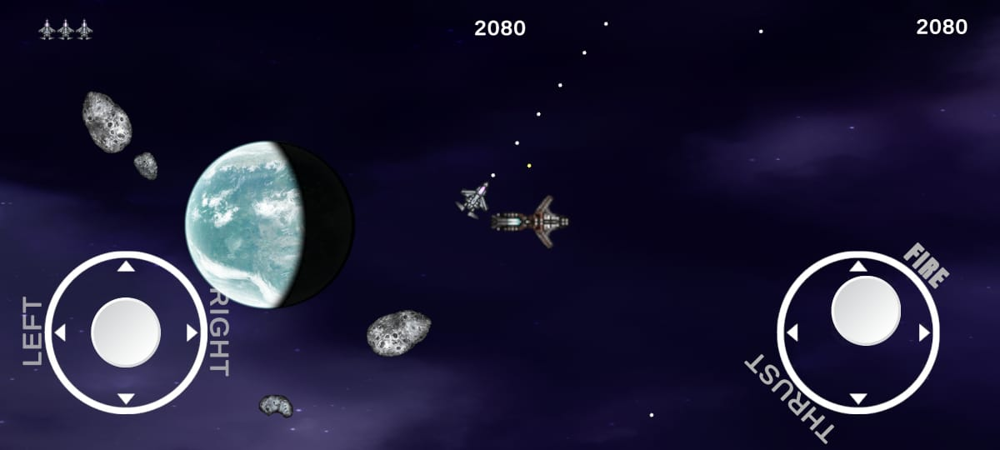

# 🚀 Great Asteroids

## 🎮 Game Overview

**Great Asteroids** is a modern reimagining of the classic arcade shooter. Choose your spaceship, select a scene, customize controls, and blast through waves of asteroids and enemy ships across deep space.

---

## 🌌 Features

- 🛸 Select from **4 unique ships**
- 🪐 Choose from **4 different scenes** (levels/environments)
- 🎯 Customize controls for **keyboard/gamepad** on PC & WebGL
- ⚡ Fast-paced asteroid-blasting action
- 🌐 Cross-platform: **PC**, **WebGL**, and **Android** (if added later)

---

## 🎯 Objective

Destroy asteroids and enemy ships while avoiding collisions.  
Score as high as possible and master control of your spacecraft across all scenes.

---

## 🕹️ Controls

### 🖥️ PC / WebGL

- Controls can be **customized** through in-game settings
- Typical default layout:
  | Action     | Key (Default)    |
  |------------|------------------|
  | Rotate     | `← / →` or `A / D` |
  | Thrust     | `↑` or `W`        |
  | Fire       | `Spacebar`        |
  | Hyperspace | `Shift`           |
  | Pause      | `Esc`             |

### 📱 Android (if supported in future)

- On-screen buttons for thrust, rotate, fire, and hyperspace

---

## 🚀 Getting Started
